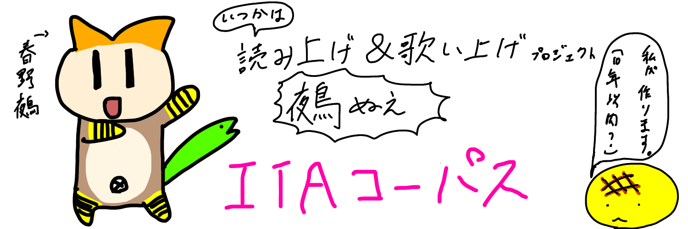

 
このデータは<a href= "https://github.com/mmorise/ita-corpus" >ITAコーパス</a>を元に春野詠(@Harunouta)が録音、ラベリングしたものです。 

[使い方:How to use] 
機械学習等にご活用ください。

[注意事項:Caution] 
読み精度の影響により、本文よりもポーズ挿入箇所が多く入っており、都度ラベル内で表記しています。 
このため、連続音素数は本家よりも少ないものになっていると思われます。 
ご利用の際は必ず「利用規約.txt」をご確認ください。 
商用・非商法に関わらず、「報道目的の利用」および「医療関係情報を扱う利用」は禁止しています。 

[連絡先:contact] 
掙の琴(twitter:@shounokoto,@Harunouta_sh) 